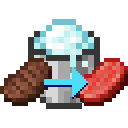

# Sfreeze

Unsmelt items by sfreezing them with powder snow!

***

When an item is within a block of powder snow for long enough, it will sfreeze the stack of items into an uncooked form. Depending on the amount of items in the stack, the powder snow has a chance of disappearing after sfreezing the stack. A stack of 64 items will always cause the powder snow to disappear.

Additionally, powder snow haas been made more easily obtainable. If a snow golem is damaged within a cauldron, it has a chance of shedding some snow into the cauldron, increasing the level of powder snow.

## What is sfreezing?

To sfreeze something is to unsmelt it; its name is derived by taking "smelt", and replacing the contained "melt" (to which "smelt" is etymologically related) with "freeze". Thence we get "sfreeze".

## How do I add my own sfreezing recipes?

Sfreezing is implemented by creating a new recipe type, so you can add your own sfreezing recipes the way you would a normal recipe, with the JSON format of

```json
{
    "type": "sfreeze:sfreezing",

    "ingredient": {
        "item": "namespace:item"
    },

    "result": "namespace:item"
}
```

This is similar to how vanilla cooking recipes are defined.